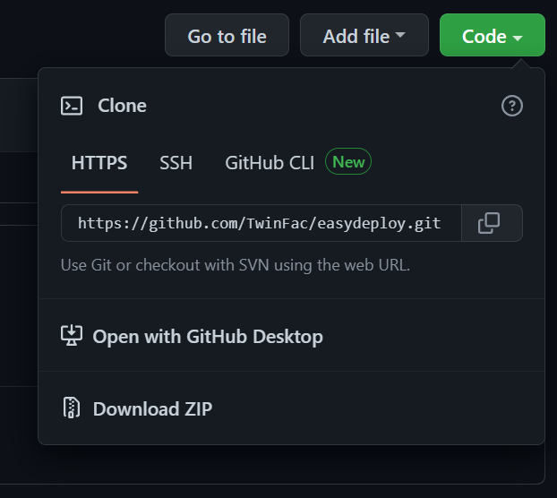

www.twinfac.com

# TwinFac deployment scripts


## Downloading easy deployment scripts

Download the repository using the download link or run the git command below

```bash
git clone https://github.com/TwinFac/easydeploy.git
```



## Install Docker with Docker Compose

https://docs.docker.com/compose/install/

## Installing TwinFac Cloud Gateway on Linux

```bash
cd easydeploy
chmod +x install.sh
./install.sh -k [API Key] -c [Company Code] -m [Manufacturer]
```

e.g.

```bash
./install.sh -k '7wGLZcxBBRAgHD4wNRrh2tAUy5r6MeO22pRmXIILU6E=' -c 'ACME' -m 'ACME Factory'
```

## Installing TwinFac Cloud Gateway on Windows

```bash
cd easydeploy
install.bat [API Key] [Company Code] [Manufacturer]
```

e.g.

```bash
install.bat '7wGLZcxBBRAgHD4wNRrh2tAUy5r6MeO22pRmXIILU6E=' 'ACME' 'ACME Factory'
```